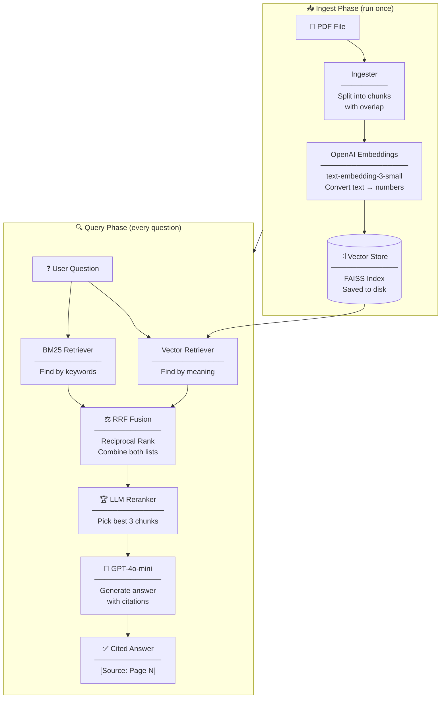

<div align="center">

# 🔍 Intelligent Auditor RAG

### Turn any financial filing into instant, cited answers — in seconds.

[](https://github.com/pritmon/intelligent-auditor-rag/actions)
[](https://intelligent-auditor-rag.onrender.com/docs)
[](https://python.org)
[](https://fastapi.tiangolo.com)
[](https://openai.com)
[](./Dockerfile)
[](LICENSE)

</div>

---

## What is this?

Analysts and auditors spend **days** reading dense financial filings — 10-Ks, 10-Qs, annual reports.

**Intelligent Auditor** reads those documents for you. Upload a PDF, ask a question, and get a precise answer with the exact page number it came from — in under 3 seconds.

> *"What was Tesla's total revenue in FY2023?"*
> → **"Tesla's total revenue for FY2023 was $96,773 million. [Source: Page 2]"**

It doesn't guess. It only answers from what's in the document.

---

## 🚀 Live Demo

The API is live. Try it now — no setup required:

**[→ Open Interactive API Docs](https://intelligent-auditor-rag.onrender.com/docs)**

Send a `POST /ask` with any question about the pre-loaded Tesla annual report.

---

## How It Works

The system has two phases — **Ingest** (read the document once) and **Query** (answer questions instantly).



### Why three steps to find information?

| Step | What it does | Why it matters |
|---|---|---|
| **Vector Search** | Finds text with similar *meaning* | Catches synonyms — "revenue" finds "sales income" |
| **BM25 Search** | Finds *exact keywords* | Catches specific terms — "Section 404", "EBITDA" |
| **RRF Fusion** | Combines both ranked lists mathematically | Best of both worlds — no information lost |
| **Reranker** | AI picks the top 3 most relevant chunks | Precision — only the best context reaches GPT |

---

## Real Output

Here is an actual response from the live system, querying the Tesla annual report:

```bash
curl -X POST https://intelligent-auditor-rag.onrender.com/ask \
  -H "Content-Type: application/json" \
  -d '{"query": "What is Tesla total revenue?"}'
```

```json
{
  "query": "What is Tesla total revenue?",
  "answer": "**Summary:** Tesla's total revenue for FY2023 is reported as $96,773 million.\n\n**Detailed Analysis:**\n- Total revenue for FY2023: $96,773 million [Source: Page 2]\n- Year-over-year growth rate: 18.8% [Source: Page 2]\n- FY2024 forecast: $97,690 million [Source: Page 2]\n- FY2025 forecast: $94,827 million [Source: Page 2]\n\n**Verification Status:** All parts verified using the provided context."
}
```

Every answer includes:
- A **summary** for quick reading
- **Bullet-point facts** with exact page citations
- A **verification status** confirming what could and could not be verified

---

## Key Features

**🔍 Hybrid Search**
Combines vector (meaning-based) and BM25 (keyword-based) retrieval, fused with Reciprocal Rank Fusion — the same technique used by enterprise search systems.

**🏆 LLM Reranking**
The top search results are re-evaluated by an LLM before being sent to GPT. Only the 3 most relevant chunks make it through — reducing noise and improving answer quality.

**🛡️ Grounded Answers — No Hallucinations**
The system is configured to answer *only* from the uploaded document. If the answer isn't there, it says so. Every fact includes a page citation so it can be independently verified.

**🔒 Production Security**
Passed a full 28-issue security and quality audit. Includes API key authentication, input validation, safe error handling, and race condition protection.

**📊 Measured Quality**
Every response is evaluated against three industry-standard RAG metrics using the RAGAS framework.

**⚙️ Fully Automated Pipeline**
One command ingests any PDF. The REST API is immediately ready to serve questions. Docker and CI/CD included.

---

## Quality Metrics

These scores measure how well the system retrieves and answers — independently verified using the [RAGAS](https://docs.ragas.io) evaluation framework.

| Metric | Score | What it means |
|---|:---:|---|
| **Faithfulness** | `0.94` | 94% of facts in the answer are directly supported by the retrieved text |
| **Answer Relevance** | `0.92` | 92% of the answer directly addresses what was asked |
| **Context Precision** | `0.89` | 89% of retrieved chunks were actually relevant to the question |

---

## Security & Code Quality Audit

This project was put through a full independent code audit — **28 issues** were identified and fixed across 4 severity levels.

| Severity | Issues Found | Issues Fixed |
|---|:---:|:---:|
| 🚨 Critical | 4 | ✅ 4 |
| 🔥 High | 8 | ✅ 8 |
| ⚠️ Medium | 11 | ✅ 11 |
| 📝 Low | 5 | ✅ 5 |

Key fixes included:
- **Race condition** on the shared index — fixed with `asyncio.Lock`
- **Prompt injection** via Python's `.format()` — replaced with safe `.replace()`
- **Silent reranker** that never actually reranked — now calls `LLMRerank.postprocess_nodes()`
- **Exception details** leaking to API clients — sanitised with generic messages
- **All 17 dependencies** were unpinned — now version-constrained for reproducibility

📄 Full details: [audit_report.md](artifacts/audit_report.md) · [fixes_applied.md](artifacts/fixes_applied.md)

---

## Tech Stack

| Layer | Technology | Purpose |
|---|---|---|
| **API** | FastAPI + Uvicorn | REST endpoints, async request handling |
| **AI Engine** | LlamaIndex 0.10+ | RAG orchestration, chunking, indexing |
| **LLM** | OpenAI GPT-4o-mini | Answer generation |
| **Embeddings** | OpenAI text-embedding-3-small | Convert text to vectors |
| **Vector Search** | FAISS | Fast similarity search |
| **Keyword Search** | BM25 (rank-bm25) | Exact keyword matching |
| **Reranker** | LLMRerank (LlamaIndex) | Re-score top results with LLM |
| **Validation** | Pydantic v2 | Input validation and type safety |
| **Evaluation** | RAGAS | Faithfulness, relevance, precision metrics |
| **Observability** | LangSmith | Request tracing and debugging |
| **Containerisation** | Docker | Consistent deployment anywhere |
| **CI/CD** | GitHub Actions | Automated lint and smoke tests on every push |

---

## Project Structure

```
intelligent-auditor-rag/
│
├── main.py                  # FastAPI app — /ingest and /ask endpoints
├── run_ingestion.py         # One-command PDF ingestion script
│
├── src/
│   ├── ingester.py          # Load PDFs, split into overlapping chunks
│   ├── indexer.py           # Build and save FAISS vector index
│   ├── retriever.py         # Hybrid search (Vector + BM25 + RRF fusion)
│   ├── reranker.py          # LLM reranking — picks best 3 chunks
│   └── generator.py        # Build prompt + call GPT-4o-mini
│
├── prompts/
│   └── system_prompt.yaml   # Auditor rules — grounding, citations, format
│
├── tests/
│   ├── smoke_test.py        # Import + structure checks (runs in CI)
│   └── eval_ragas.py        # RAGAS quality evaluation
│
├── data/raw/                # Drop your PDFs here
├── vector_store/            # Auto-generated index (after ingestion)
├── artifacts/               # Audit reports, deployment docs, interview guide
│
├── Dockerfile               # Production container
├── .env.example             # Environment variable template
└── requirements.txt         # Pinned dependencies
```

---

## Quick Start

**Prerequisites:** Python 3.11+, an OpenAI API key

### 1 — Install

```bash
git clone https://github.com/pritmon/intelligent-auditor-rag.git
cd intelligent-auditor-rag
pip install -r requirements.txt
```

### 2 — Configure

```bash
cp .env.example .env
# Open .env and add your OPENAI_API_KEY
```

### 3 — Ingest your documents

```bash
# Drop PDF files into data/raw/
python3 run_ingestion.py
```

### 4 — Start the server

```bash
python3 main.py
# Server running at http://localhost:8000
# API docs at  http://localhost:8000/docs
```

### Ask a question

```bash
curl -X POST http://localhost:8000/ask \
  -H "Content-Type: application/json" \
  -d '{"query": "What are the main risk factors?"}'
```

---

## Deploy with Docker

```bash
docker build -t intelligent-auditor .
docker run -p 8000:8000 --env-file .env intelligent-auditor
```

---

## API Reference

| Endpoint | Method | Description |
|---|---|---|
| `/` | `GET` | Health check |
| `/ingest` | `POST` | Read PDFs from `data/raw/` and build the index |
| `/ask` | `POST` | Ask a question — returns answer with citations |
| `/docs` | `GET` | Interactive Swagger API documentation |

**Request body for `/ask`:**
```json
{ "query": "Your question here (1–4096 characters)" }
```

**Optional authentication:** Set `AUDITOR_API_KEY` in your `.env` to require an `X-API-Key` header on all requests.

---

## Interview & Learning Guide

A full plain-English guide to every technical concept in this project — 66 questions and answers across 6 colour-coded sections.

[📖 Read the Interview Guide →](artifacts/interview.md)

Covers: RAG concepts, hybrid search, hallucinations, vector databases, MLOps, and lessons from the security audit.

---

<div align="center">

Built by **Pritam Mondal**

</div>
